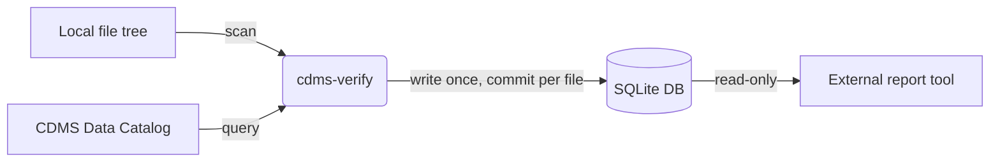
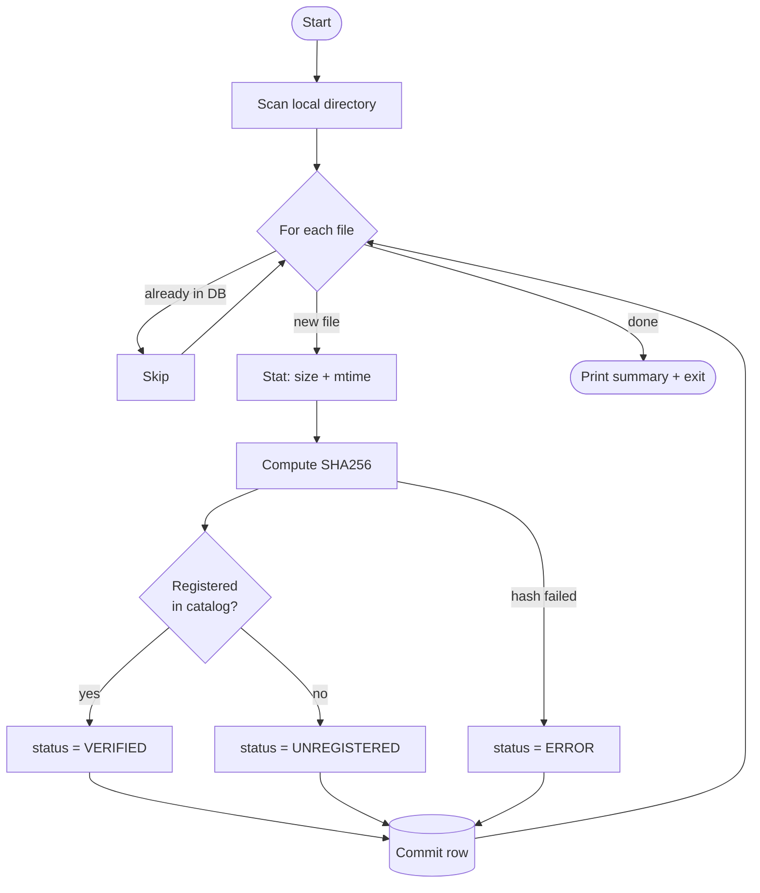

<div align="center">

# 🔬 CDMS Verify

**Reconcile a local file tree against the CDMS Data Catalog — fast, resumable, and reproducible.**

[](https://github.com/omar-moreno/cdms-verify/actions/workflows/ci.yml)
[](https://github.com/omar-moreno/cdms-verify/actions/workflows/docs.yml)
[](https://www.python.org/)
[](https://github.com/psf/black)

[Documentation](https://omar-moreno.github.io/cdms-verify/) •
[Installation](#-installation) •
[Usage](#-usage)

</div>

---

## 📖 Overview

`cdms-verify` scans a local directory, derives each file's expected **CDMS
catalog path**, and checks whether it is registered in the
[CDMS Data Catalog](https://your-org.github.io/cdms-verify/). Results — status,
SHA256 checksum, size, and modification time — are persisted to a lightweight
**SQLite** database.

The tool is a pure **writer**: reporting is decoupled into a separate read-only
service, keeping the verification job simple and reproducible in Kubernetes.



---

## ✨ Features

| | Feature | Description |
|---|---------|-------------|
| 🔁 | **Record-once semantics** | A `UNIQUE(file_path)` constraint guarantees each file is stored exactly once. Re-runs skip known files. |
| 💾 | **Incremental durability** | Every result is committed *per file* — an interrupted run never loses completed work. |
| 📦 | **Zero-config storage** | A single SQLite `.db` file. No database server to deploy. |
| 📊 | **Drift-free summaries** | Status counts are derived on demand, never stored. |
| 🔍 | **Change-detection ready** | Stores `size` and `mtime` so an external tool can detect modified files. |

---

## 📑 Table of Contents

- [Installation](#-installation)
- [Usage](#-usage)
- [How It Works](#-how-it-works)
- [Database Schema](#-database-schema)
- [Development](#-development)
- [License](#-license)

---

## 🚀 Installation

```bash
git clone https://github.com/your-org/cdms-verify.git
cd cdms-verify
pip install -e ".[dev,docs]"
```

</details>

> [!NOTE]
> The internal `CDMSDataCatalog` client is required at **runtime** to query a
> live catalog. The pure helper modules (`paths`, `scanning`, `database`) can be
> imported and tested without it.

---

## 🛠 Usage

```bash
cdms-verify \
  --local-dir /sdf/data/supercdms/data/CDMS/SNOLAB \
  --site SLAC \
  --db-path verification.db
```

### Options

| Option | Short | Default | Description |
|--------|:-----:|---------|-------------|
| `--local-dir` | `-d` | *required* | Directory to verify. |
| `--site` | `-s` | `SLAC` | Site where the local directory is located (e.g. SLAC, SNOLAB) |
| `--recursive/--no-recursive` | `-r/-nr` | `True` | Recurse into subdirectories. |
| `--db-path` | | `verification.db` | SQLite results database. |
| `--verbose` | `-v` | `False` | Verbose per-file output. |

### Exit codes

| Code | Meaning |
|:----:|---------|
| `0` | ✅ All new files verified (or nothing new to do). |
| `1` | ⚠️ Discrepancies found (unregistered files or errors). |
| `2` | ❌ Usage error (e.g. missing `--local-dir`). |

> [!TIP]
> These map directly to Kubernetes Job success/failure semantics, so a failed
> verification naturally fails the Job.

### Querying results

The database is the source of truth — query it with plain SQL:

```sql
-- Files under a catalog path prefix
SELECT file_path, status, checksum, scan_timestamp
FROM verification_results
WHERE catalog_path = '/CDMS/SNOLAB'
   OR catalog_path LIKE '/CDMS/SNOLAB/%';

-- Everything still unregistered
SELECT file_path, catalog_path
FROM verification_results
WHERE status = 'UNREGISTERED';
```

---

## ⚙️ How It Works



1. **Scan** the local directory for files.
2. **Skip** any file already recorded in the database.
3. For each *new* file: stat it, checksum it, and check registration.
4. **Commit** the result immediately — durable per file.

---

## 🗄 Database Schema

A single table; summary counts are derived on demand.

```sql
CREATE TABLE verification_results (
    id             INTEGER PRIMARY KEY AUTOINCREMENT,
    file_path      TEXT    NOT NULL UNIQUE,  -- record-once guarantee
    catalog_path   TEXT    NOT NULL,         -- indexed for prefix queries
    status         TEXT    NOT NULL,         -- VERIFIED | UNREGISTERED | ERROR
    checksum       TEXT,                      -- SHA256 hex
    size           INTEGER,                   -- bytes at scan time
    mtime          REAL,                      -- POSIX mtime
    site           TEXT    NOT NULL,          -- catalog site queried
    scan_timestamp TEXT    NOT NULL           -- when recorded
);
```
---

## 🧪 Development

```bash
# Install with dev + docs tooling
pip install -e ".[dev,docs]"

# Run the test suite with coverage
pytest -v --cov=cdms_verify --cov-report=term-missing

# Preview the documentation locally
mkdocs serve   # http://127.0.0.1:8000
```

### Project layout

```
cdms_verify/
├── paths.py       # path normalization + catalog-path extraction
├── scanning.py    # filesystem scan, checksum, stat
├── catalog.py     # catalog query wrapper
├── database.py    # single-table SQLite persistence
├── schema.sql     # database schema
└── cli.py         # Click entry point
tests/
├── test_paths.py
├── test_scanning.py
├── test_database.py
└── test_cli.py
```

> [!TIP]
> Contributions welcome! Please run `pytest` and `mkdocs build --strict`
> before opening a pull request.

---

<div align="center"> <sub>Built for the CDMS Collaboration • Powered by Python, Click, and SQLite</sub> </div>
