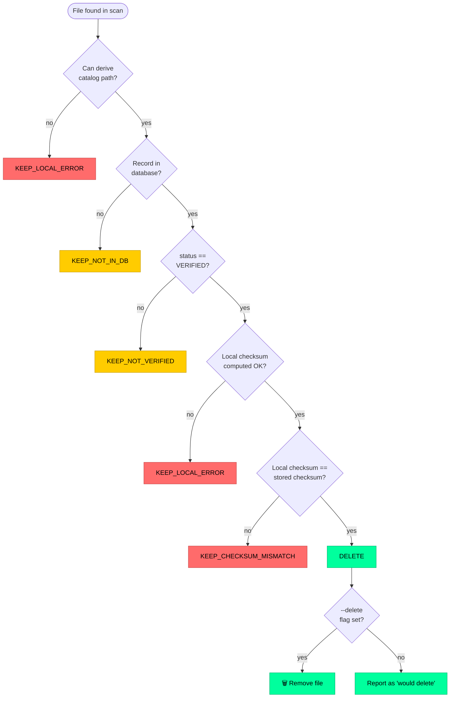

# File Cleanup

`cdms-cleanup` safely removes local files that have been **verified and
checksum-matched** in the CDMS verification database. It is designed to run as a
cron job on a machine *other* than the one that produced the database.

!!! danger "This tool deletes files"
    Deletion is irreversible. By default `cdms-cleanup` runs as a **dry-run**
    and deletes nothing. You must pass `--delete` to actually remove files.
    Always review a dry-run before enabling deletion.

## How it decides

A file is deleted **only** when *both* conditions hold:

1. Its catalog record has `status == 'VERIFIED'`.
2. The local file's freshly-computed SHA256 matches the stored checksum.

Any other outcome keeps the file. The possible per-file decisions are:

| Decision | Meaning | Action |
|----------|---------|:------:|
| `DELETE` | Verified and checksum matches | 🗑️ deleted (with `--delete`) |
| `KEEP_NOT_IN_DB` | No record for this catalog path | ✅ kept |
| `KEEP_NOT_VERIFIED` | Record exists but status ≠ `VERIFIED` | ✅ kept |
| `KEEP_CHECKSUM_MISMATCH` | Local checksum ≠ stored checksum | ✅ kept |
| `KEEP_LOCAL_ERROR` | File unreadable, no catalog path, or delete failed | ✅ kept |

## Decision flow


Every path except the rightmost leads to the file being **kept**. Deletion
happens only after all four checks pass *and* `--delete` is supplied.

## Cross-machine matching

The cleanup runs on a different machine than the verifier, so local absolute
paths differ. Matching is therefore done on the **machine-independent
`catalog_path`** (derived from the `CDMS` component of the path), not on the
stored `file_path`.

```
Verifier machine:  /data/store/CDMS/Raw/run1.dat  ─┐
                                                    ├─ catalog_path: /CDMS/Raw/run1.dat
Cleanup machine:   /mnt/local/CDMS/Raw/run1.dat  ──┘
```

Both layouts share the same `catalog_path`, so the record is found regardless
of prefix.

## Usage

```bash
# Dry-run first — ALWAYS. Deletes nothing, reports what would happen.
cdms-cleanup \
  --local-dir /mnt/local/CDMS/Raw \
  --db-path /shared/verification.db

# After reviewing the dry-run, actually delete eligible files.
cdms-cleanup \
  --local-dir /mnt/local/CDMS/Raw \
  --db-path /shared/verification.db \
  --delete
```

### Options

| Option | Short | Default | Description |
|--------|:-----:|---------|-------------|
| `--local-dir` | `-d` | *required* | Local directory to clean up (must contain a `CDMS` component). |
| `--db-path` | | *required* | Verification database (opened **read-only**). |
| `--recursive/--no-recursive` | `-r/-nr` | `True` | Recurse into subdirectories. |
| `--delete` | | `False` | Actually delete. Without it, runs as a dry-run. |
| `--verbose` | `-v` | `False` | Enable DEBUG logging. |

### Exit codes

| Code | Meaning |
|:----:|---------|
| `0` | Success (including dry-runs) with no problems. |
| `1` | A checksum mismatch or local error occurred — review needed. |

## Safety guarantees

- **Dry-run by default** — deletion requires an explicit `--delete`.
- **Read-only database** — the cleanup opens the DB with `mode=ro` and can
  never modify verification data. Safe to run alongside the verifier (WAL
  allows concurrent reads).
- **Delete only on positive confirmation** — verified status *and* checksum
  match are both required.
- **Fail safe** — any error or uncertainty keeps the file and is reported.
